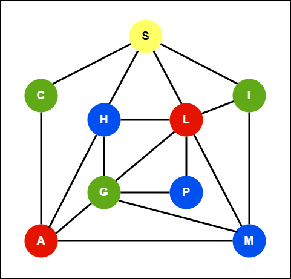

# Graph-Coloring
## Definicion del Problema

En la teoría de grafos, el problema de 'Graph Coloring' es la tarea de asignar colores a los vértices de un grafo de modo que a los pares de vértices adyacentes se les asignan diferentes colores, y el número de colores diferentes utilizados en el gráfico es mínimo.

**El problema Graph Coloring es un problema NP-completo.**

## Número Crómatico

El número más pequeño de colores necesarios para colorear un gráfico G se llama su número cromático.
 
## Aplicaciones

1) Elaboración de un horario o tabla de tiempos.
2) Asignación de frecuencias de radio móvil.
3) Sudoku.
4) Asignación de registros.
5) Grafos bipartitos.
6) Colorear mapas.

## Grafo de Ejemplo

El siguiente gráfico ha sido coloreado usando solo cuatro colores (rojo, azul, verde y amarillo). Este es en realidad el número mínimo de colores necesarios para este grafo en particular, es decir, no podemos colorear este grafo usando menos de cuatro colores mientras nos aseguramos de que los vértices adyacentes tengan un color diferente.



Así que el número cromático de este gráfico es 4 y se denota x(G), significa x(G)=4.

## Solucion del Grafo de Ejemplo

### Vector de Solución
**[S H P C I L G A M]**

**[1,2,2,3,3,4,3,4,2]**

1. Amarrilo
2. Azul
3. Verde
4. Rojo

### Matriz de adyacencia

|  |S |H |P |C |I |L |G |A |M |
|--|--|--|--|--|--|--|--|--|--|
|**S** |0 |1 |0 |1 |1 |1 |0 |0 |0 |
|**H** |1 |0 |0 |0 |0 |1 |1 |1 |0 |
|**P** |0 |0 |0 |0 |0 |1 |1 |0 |0 |
|**C** |1 |0 |0 |0 |0 |0 |0 |1 |0 |
|**I** |1 |0 |0 |0 |0 |1 |0 |0 |1 |
|**L** |1 |1 |1 |0 |1 |0 |1 |0 |1 |
|**G** |0 |1 |1 |0 |0 |1 |0 |1 |1 |
|**A** |0 |0 |0 |1 |0 |0 |1 |0 |1 |
|**M** |0 |0 |0 |0 |1 |1 |1 |1 |0 |

## Leer el grafo
``` python
import csv
newMatrix = []
with open('nombre.csv', 'r', newline='') as file:
  myreader = csv.reader(file, delimiter=',')
  for rows in myreader:
   newMatrix.append(rows)
newMatrix = np.array(newMatrix)
```

## Función de costo
``` python
def Costo(sol):
  ncolores=len(Counter(sol))
  return ncolores
```

## Funcion generar vecino
``` python
#Comprobar cada borde
def isSafe(graph, color, size):
  for i in range(size):
    for j in range(i + 1, size):
      if (graph[i][j] and color[j] == color[i]):
        return False
  return True

def Genera_Vecino(size,graph):
  sol = [0 for i in range(size)]
  ncolor=random.uniform(1, size+1)
  for i in range(size):
    r = int(random.uniform(1, ncolor))
    sol[i] = r
  #verfifica que la solucion sea valida  
  if (isSafe(graph, sol,size))==-1:
    sol=Genera_Vecino(size,graph)
  return sol
```
##  Instancias a ejecutar
``` python
solucion = Genera_Vecino(10, newMatrix)
print("Solución: ", solucion)
print("Número Crómatico: ", Costo(solucion))
```

### 10 Nodos

|0|1|0|0|0|0|0|1|1|0|
|-|-|-|-|-|-|-|-|-|-|
|1|0|0|1|0|1|0|1|1|0|
|0|0|0|1|0|0|0|0|0|1|
|0|1|1|0|1|1|0|0|1|0|
|0|0|0|1|0|0|0|1|0|0|
|0|1|0|1|0|0|1|1|0|1|
|0|0|0|0|0|1|0|0|1|0|
|1|1|0|0|1|1|0|0|0|0|
|1|1|0|1|0|0|1|0|0|0|
|0|0|1|0|0|1|0|0|0|0|

Solución:  [7, 10, 8, 5, 8, 8, 5, 5, 3, 6]

Número Crómatico:  6

### 125 Nodos

Solución:  [15, 53, 6, 24, 45, 121, 1, 72, 88, 56, 120, 79, 69, 8, 50, 16, 109, 89, 30, 19, 90, 20, 50, 60, 35, 65, 2, 92, 111, 110, 68, 80, 89, 114, 9, 78, 86, 98, 11, 46, 78, 46, 108, 73, 83, 124, 3, 3, 119, 74, 77, 81, 88, 89, 38, 6, 109, 18, 19, 24, 64, 15, 58, 66, 121, 64, 14, 57, 74, 96, 105, 21, 94, 97, 89, 77, 106, 112, 82, 44, 94, 40, 118, 32, 6, 15, 91, 50, 9, 59, 119, 61, 36, 17, 43, 82, 113, 88, 84, 105, 52, 20, 92, 29, 32, 15, 57, 20, 63, 116, 71, 68, 120, 6, 73, 108, 28, 118, 6, 5, 92, 69, 77, 107, 123]

Número Crómatico:  83

### 300 Nodos

Solución:  [57, 48, 58, 60, 40, 41, 36, 53, 36, 50, 55, 44, 4, 16, 3, 41, 7, 28, 21, 35, 43, 19, 3, 5, 38, 60, 41, 37, 40, 2, 23, 47, 32, 43, 20, 18, 20, 34, 37, 48, 43, 24, 19, 5, 14, 10, 51, 17, 62, 26, 44, 38, 33, 60, 58, 39, 61, 22, 41, 46, 45, 58, 27, 60, 33, 34, 14, 35, 40, 43, 7, 38, 56, 22, 17, 35, 51, 34, 36, 7, 19, 19, 56, 30, 53, 25, 21, 25, 30, 57, 1, 1, 5, 32, 44, 1, 47, 42, 23, 35, 53, 26, 22, 9, 24, 47, 47, 27, 45, 28, 46, 42, 52, 53, 17, 1, 4, 13, 30, 53, 22, 34, 14, 2, 32, 3, 53, 61, 19, 35, 22, 59, 25, 21, 2, 7, 30, 58, 35, 35, 18, 7, 32, 31, 60, 19, 32, 53, 1, 51, 59, 20, 6, 12, 11, 19, 58, 50, 57, 37, 27, 30, 52, 54, 38, 31, 40, 46, 14, 47, 3, 53, 25, 4, 28, 54, 39, 37, 56, 31, 41, 43, 48, 24, 13, 27, 22, 46, 14, 29, 42, 52, 62, 37, 49, 34, 26, 22, 57, 11, 39, 19, 26, 46, 13, 38, 48, 12, 21, 9, 18, 27, 7, 29, 56, 43, 49, 17, 59, 55, 1, 53, 21, 8, 19, 3, 44, 43, 43, 36, 35, 25, 26, 15, 51, 52, 15, 33, 57, 42, 57, 46, 38, 56, 46, 19, 45, 52, 6, 44, 51, 12, 19, 52, 25, 28, 33, 40, 40, 24, 47, 15, 38, 11, 40, 52, 37, 46, 40, 60, 8, 44, 57, 8, 1, 20, 8, 44, 39, 51, 58, 16, 60, 28, 36, 21, 52, 18, 8, 24, 25, 45, 39, 34, 49, 1, 10, 11, 36, 38]

Número Crómatico:  62
